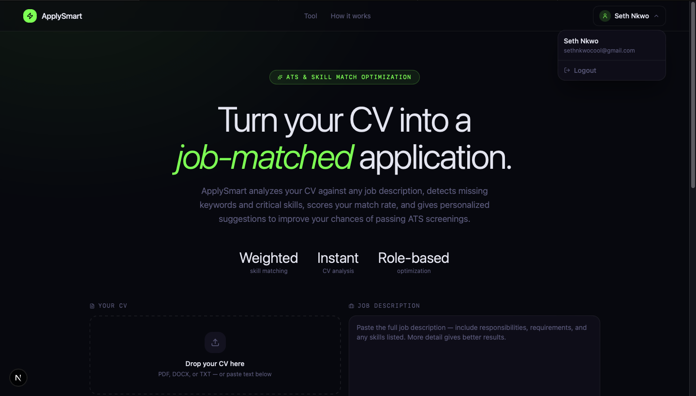
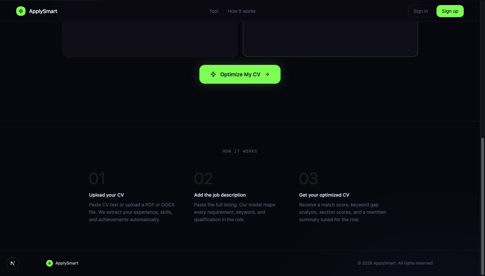
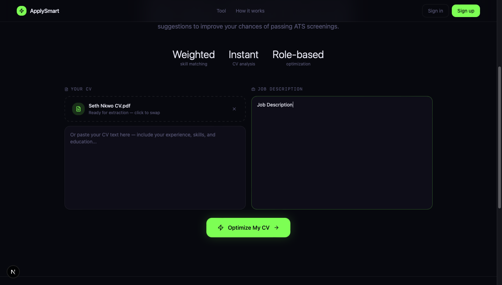
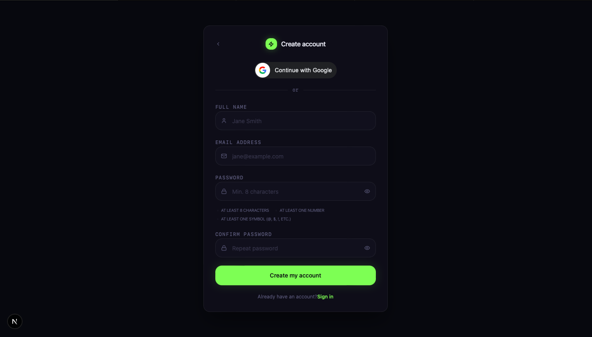
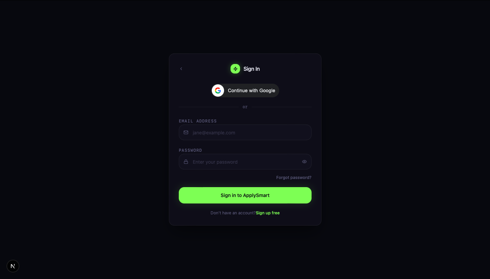

# 🚀 ApplySmart

ApplySmart is an AI-powered resume optimization platform designed to help job seekers tailor their CVs to specific job descriptions, improve ATS compatibility, and increase interview chances through intelligent resume analysis and optimization.

The platform analyzes uploaded resumes against job listings, identifies keyword gaps, evaluates ATS match quality, and provides AI-assisted improvements to help users create stronger applications.

---

## 🌍 Live Frontend Preview

🚀 https://apply-smart-six.vercel.app

> Backend AI optimization pipeline is currently under active development.

---

## 🌐 Vision

Modern hiring systems rely heavily on Applicant Tracking Systems (ATS), making it difficult for qualified candidates to get noticed.

ApplySmart aims to bridge this gap by combining:
- Context-aware, schema-constrained AI resume analysis
- Dynamic ATS suitability assessment metrics
- In-memory dictionary skill classification with priority weighting
- Tailored training path aggregation to automatically resolve detected skill gaps
- Clean, secure, and modern SaaS-style user environments

---

## ✨ Current Features & Platform Capabilities

- 🔐 **Authentication Architecture**
  - Secure short-lived JWT access tokens with long-lived session persistence.
  - Strict HTTP-only cookie-based refresh tokens defending against XSS vectors.
  - Multi-provider architecture managing traditional Local Email and Google OAuth pipelines.
  - Intelligent, email-aware automated account linking on identical address match profiles.
  - Global, hydrated frontend state distribution managed cleanly via Zustand.

- 📄 **Flexible Resume Ingestion**
  - High-fidelity drag-and-drop file upload interface supporting PDF, DOCX, and TXT files.
  - Instant text-pasting fallback canvas for ad-hoc manual optimization inputs.
  - Multer-driven in-memory buffering preventing disk exposure vulnerabilities during extraction parsing.
  - Real-time toast-driven pipeline response alerts using Sonner.

- 🤖 **Gemini Optimization Engine**
  - Contextual target evaluation using schema-enforced JSON structures via `gemini-2.5-flash`.
  - Upstream 503 error interceptors converting system surges into user-friendly retry loops.
  - In-memory Dictionary Matrix Lookups grouping matching DB documents efficiently without $N+1$ latency loops.
  - **Dynamic Knowledge Bridges:** Automatically links missing semantic skills directly to curated seed documentation paths (e.g., matching a missing "Next.js" tag to its official learning modules).

- 🎨 **Modern UX Engine**
  - Immersive, dark-themed SaaS aesthetic designed around custom CSS radial accent blooms.
  - Staged, asynchronous animated tracking loops displaying sequential pipeline updates.
  - Responsive, mobile-first design layout utilizing Tailwind CSS flex/grid distribution patterns.
  - Interactive, dynamic radial SVG charts projecting real-time ATS score metrics.

---

## 🖼️ Project Screenshots

Below are key screenshots showcasing the main features of ApplySmart:

| Feature | Screenshot | Description |
|---------|------------|-------------|
| Landing Page |  | ApplySmart Landing Page (Logged in). |
| Landing Page 2 |  | ApplySmart Landing Page. |
| Optimization Tool |  | Main Optimization Tool. |
| Sign Up |  | ApplySmart Sign Up Page. |
| Sign In |  | ApplySmart Sign In Page. |

---

## 🧠 Core Engineering Highlights

### 🛡️ Hybrid Identity Rate Limiting Guard
To safeguard commercial Gemini API resource pipelines from rogue load distribution and automated script exploitation, the `/api/optimize` endpoint uses a strict request throttle framework managed via `express-rate-limit`.

```typescript
// Strict operational limits capped at 5 attempts per minute
const aiOptimizationLimiter = rateLimit({
    windowMs: 60 * 1000, 
    max: 5, 
    keyGenerator: (req: AuthRequest, res: Response) => {
        return req.user?.userId ?? ipKeyGenerator(req as any, res as any);
    }, 
    message: {
        success: false,
        message: "You are optimizing resumes too quickly. Please wait a minute before analyzing another CV."
    }
});
```

- Why it's structured this way: Traditional IP limits risk blocking multiple distinct users inside identical corporate or public local networks. By configuring a fallback parameter that keys off validated MongoDB user identity objects (req.user.userId) first before reverting to incoming network routing strings, the system guarantees accurate user throttle metrics without cross-user disruption.

---

## 🤖 AI Optimization Engine

ApplySmart integrates Google Gemini to generate structured ATS optimization reports.

The optimization engine:

- analyzes uploaded resumes against job descriptions
- generates ATS compatibility scores
- identifies missing and detected skills
- produces structured optimization summaries
- maps AI-detected skills against internal database records

The AI pipeline uses:

- schema-constrained JSON responses
- centralized parsing validation
- asynchronous optimization processing
- persistent optimization history tracking
- failure-state recovery architecture

---

### Multi-Provider Authentication
ApplySmart supports both traditional email/password authentication and Google OAuth sign-in.

The authentication system intelligently handles:
- local authentication
- Google OAuth login
- account linking by email
- provider-aware login validation
- JWT issuance across authentication providers

Users who initially register with email/password can later authenticate using Google with automatic account linking support.

---

### Frontend State Management
Authentication state is managed globally using Zustand:
- automatic auth hydration
- centralized login/logout handling
- token refresh handling
- loading synchronization across the app

---

### Resume Upload Pipeline

ApplySmart includes a flexible resume ingestion system supporting:
- drag-and-drop uploads
- PDF/DOCX/TXT files
- direct resume text pasting
- upload state management
- protected optimization access flow

The upload architecture was designed to support future AI-powered parsing and resume analysis pipelines.

### ⚙️ Resume Parsing & Processing Pipeline

ApplySmart includes a backend resume ingestion pipeline engineered for scalable AI analysis workflows.

Supported File Types:
- PDF
- DOCX
- TXT

#### Pipeline Architecture
The upload system uses:

- Multer memory storage for in-memory processing
- MIME-type validation middleware
- file size protection limits
- centralized upload error handling
- asynchronous text extraction utilities

#### Parsing Stack

- pdf-parse for PDF extraction
- mammoth for DOCX extraction
- custom normalization utilities for text cleanup

The extraction pipeline also handles:

- malformed uploads
- unsupported MIME types
- empty or unreadable documents
- centralized validation responses

This architecture was designed to support future:

- AI resume rewriting
- ATS scoring
- semantic skill extraction
- optimization history tracking
- resume intelligence pipeline

### Decoupled Architecture

ApplySmart follows a fully decoupled architecture:
- Next.js frontend
- Express.js backend API
- Separate authentication layer
- AI optimization service integration

This structure improves scalability, maintainability, and deployment flexibility.

---

## 🧰 Tech Stack

| Category | Tools |
|----------|--------|
| **Frontend UI Stack** | Next.js (App Router), React, TypeScript, Tailwind CSS, Lucide React, Sonner |
| **Backend API Layer** | Node.js, Express.js (TypeScript architecture), Express Rate Limit |
| **Database** | MongoDB, Mongoose ODM |
| **Authentication** | JSON Web Tokens (JWT), Secure HTTP-Only Cookie Arrays, Google Auth Library |
| **State Management** | Zustand |
| **Validation & Uploads** | Zod, Multer |
| **Parsing Engines** | pdf-parse, mammoth |
| **AI Integration** | Google Gemini API Framework (gemini-2.5-flash engine) |
| **Deployment** | Vercel *(frontend deployed)* / Render *(planned)* |

---

## 🏗 Architecture Overview

ApplySmart follows a modular full-stack architecture:

### Frontend
- App Router architecture
- reusable component system
- centralized auth store
- API abstraction layer
- protected route structure

### Backend
- controller/service architecture
- JWT authentication
- refresh token handling
- centralized error handling
- scalable route organization

---

## 👨🏿‍💻 Optimization Engine Architecture

ApplySmart introduces a modular optimization architecture designed around scalable resume intelligence workflows.

### Core Models
- `User`
- `Skill`
- `Optimization`

### Skill Intelligence System

The platform includes a categorized skill engine with:
- weighted importance scoring
- alias-based skill matching
- categorized industry skills
- recommendation generation
- learning resource mapping

### Optimization Tracking

Each optimization stores:
- uploaded resume metadata
- extracted raw resume text
- ATS score results
- job description context
- matched/missing skills
- generated optimization summaries

This structure enables:
- historical optimization tracking
- future analytics dashboards
- AI-assisted rewrite suggestions
- resume improvement insights

---

## 🔐 Authentication Flow

1. User signs in with email/password or Google OAuth
2. Backend verifies credentials or Google ID token
3. Access token returned to frontend
4. Refresh token stored securely in HTTP-only cookie
5. Zustand hydrates auth state
6. Session restored automatically on refresh

---

## 📌 Planned Features

- ✍️ AI Resume Rewriting
- 📊 Resume Analytics Dashboard
- 🔍 Skill Gap Detection
- 💳 Payment Integration
- 👤 User Dashboard
- 📂 Resume History
- 🐳 Docker Support
- ⚙️ CI/CD Pipeline

---

## ⚙️ Local Development Setup

### 1. Clone repository

```bash
git clone https://github.com/sethnkwo8/ApplySmart.git
```

### 2. Frontend setup

```bash
cd applysmart-web
npm install
npm run dev
```

### 3. Backend setup

```bash
cd applysmart-api
npm install
npm run dev
```

## 🌍 Environment Variables

**Frontend** .env.local

```env
NEXT_PUBLIC_API_URL=http://localhost:5000
NEXT_PUBLIC_GOOGLE_CLIENT_ID=your_google_client_id
```

**Backend** .env

```env
PORT=5000
MONGO_URI=your-mongo-uri
JWT_SECRET=your_jwt_secret
JWT_REFRESH_SECRET=your_refresh_secret
NODE_ENV=development
GOOGLE_CLIENT_ID=your_google_client_id
GOOGLE_CLIENT_SECRET=your_google_secret
GEMINI_API_KEY=your_gemini_api_key
```

## 🧪 Current Status
ApplySmart is actively under development.

Current focus:

- AI optimization engine integration
- semantic skill matching
- ATS scoring algorithms
- Gemini-powered rewrite suggestions
- optimization dashboard architecture
- historical resume analytics

---

## 📖 Lessons Learned

- Secure authentication architecture
- Refresh token handling
- Zustand state management
- Decoupled frontend/backend systems
- Production-style session persistence
- API abstraction patterns
- Modern SaaS UI architecture
- OAuth authentication flows
- Google ID token verification
- multi-provider account management
- secure cookie-based auth architecture
- file upload middleware architecture
- MIME-type validation strategies
- document parsing pipelines
- asynchronous controller handling
- centralized Express error architecture
- scalable MongoDB schema design
- optimization engine modeling

---

## 🛡 Security Considerations
ApplySmart implements several production-style security practices:

- HTTP-only refresh token cookies
- short-lived access tokens
- secure JWT verification
- provider-aware authentication validation
- centralized backend error handling
- protected session restoration flow
- password hashing with bcrypt
- secure Google ID token verification
- MIME-type upload validation
- file size restriction enforcement
- centralized async error handling
- protected upload pipeline architecture
- in-memory upload processing
- AI optimization rate-limiting
- user-based request throttling

---

## 📬 Contact

- Portfolio: https://seth-nkwo.vercel.app
- LinkedIn: https://www.linkedin.com/in/seth-nkwo/
- GitHub: https://github.com/sethnkwo8

---

## ⭐ Acknowledgements

ApplySmart is built as a production-style SaaS application designed to solve real-world hiring hurdles while mastering complex architectural engineering, programmatic optimizations, and context-aware AI application pipelines.

Special recognition belongs to:

- Google Gemini & Google AI Studio: For providing robust, low-latency API infrastructure allowing high-fidelity, schema-constrained text transformations.
- The Open Source Software Community: The engineers behind Next.js, Express, Mongoose, and Zustand for empowering self-contained full-stack product iteration loops.

This project continues to evolve as new features, cloud infrastructure improvements, DevOps practices, and AI capabilities are added.

